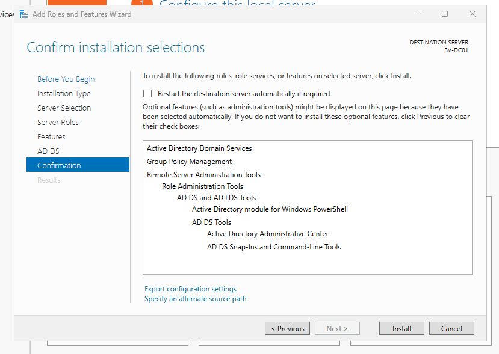
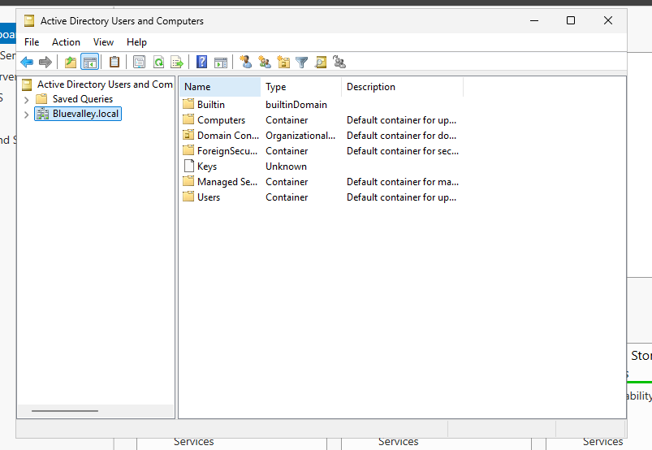
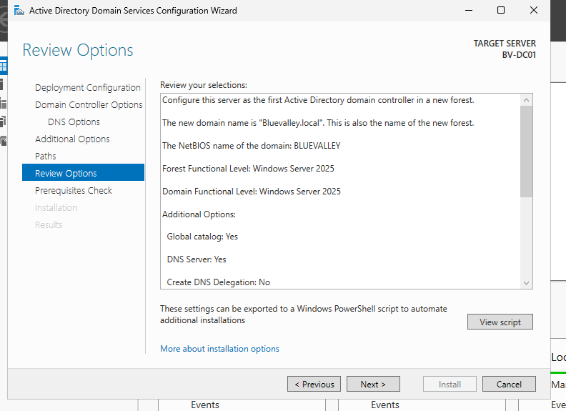
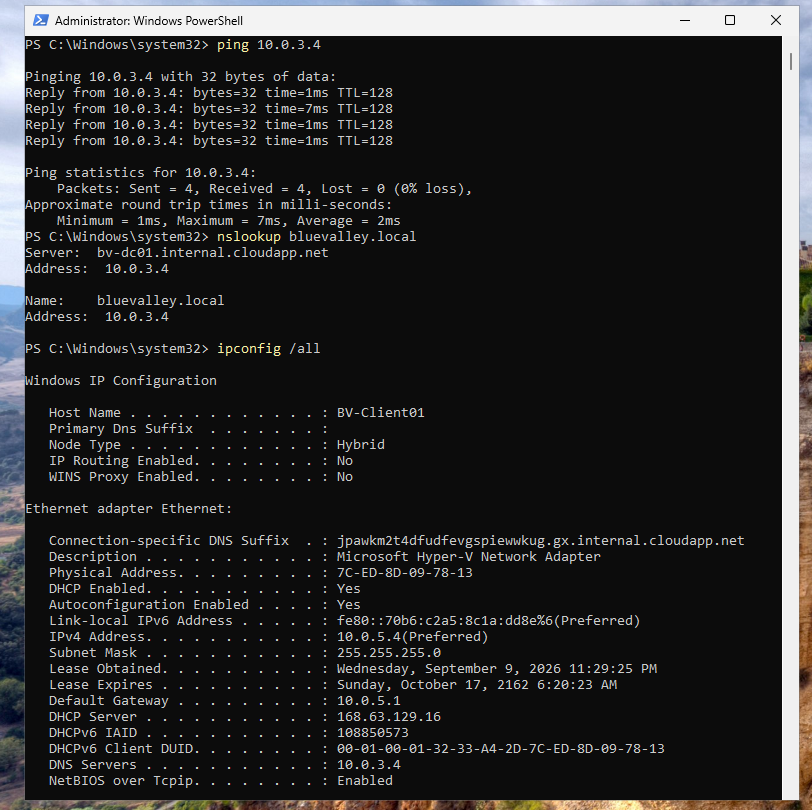

[← Back to Main Project](../README.md)

# Blue Valley Active Directory Infrastructure

## Overview

This section documents the creation and configuration of the Active Directory infrastructure used for the **Blue Valley IT Help Desk Lab**.

The goal was to build a simulated Windows business environment where domain users could be centrally managed and authenticated. This environment would later provide the foundation for realistic Help Desk scenarios involving account management, permissions, security groups, and employee onboarding.

The lab was hosted in **Microsoft Azure** and consisted of two primary virtual machines:

- **BV-DC01** - Windows Server domain controller running Active Directory Domain Services (AD DS) and DNS.
- **BV-Client01** - Windows 11 client workstation joined to the Blue Valley domain.

The basic infrastructure followed this design:

**Microsoft Azure → Virtual Network → BV-DC01 (Domain Controller/DNS) → BV-Client01 (Domain Client)**

---

## 1. Azure Lab Environment

Before configuring Active Directory, I created the Azure infrastructure required to host the Windows domain environment.

### Resource Group

I used an Azure Resource Group to keep the resources associated with the Blue Valley lab organized together.

**Why this was important:**  
A Resource Group provides a logical container for related Azure resources. Keeping the virtual machines, networking components, and other lab resources organized together makes the environment easier to manage.

### Virtual Network

I configured an Azure Virtual Network (VNet) so the domain controller and client workstation could communicate with each other over a private network.

**Why this was important:**  
Active Directory relies on network communication between domain clients and the domain controller. Placing both virtual machines on the same virtual network allows BV-Client01 to communicate with BV-DC01 for DNS resolution, authentication, and other domain services.

---

## 2. Creating the Virtual Machines

Two Azure virtual machines were used to simulate the Blue Valley business environment.

### BV-DC01 - Domain Controller

BV-DC01 was created as the Windows Server virtual machine that would become the domain controller for the Blue Valley domain.

BV-DC01 was used to provide:

- Active Directory Domain Services
- DNS
- Domain authentication
- User and group management
- Group Policy
- Centralized administration of the Blue Valley domain

### BV-Client01 - Domain Workstation

BV-Client01 was created as a Windows 11 workstation to simulate an employee computer within the organization.

This workstation would later be joined to the Blue Valley domain and used to test:

- Domain user authentication
- Active Directory account changes
- Group memberships
- Resource permissions
- Remote access
- Help Desk troubleshooting scenarios

**Why two virtual machines were used:**  
Separating the domain controller and client workstation created a more realistic client-server environment. Instead of performing all tasks on a single computer, the client depended on the domain controller for centralized authentication and domain services.
---

## 3. Installing Active Directory Domain Services

With the Azure infrastructure and virtual machines in place, the next step was to configure BV-DC01 to provide centralized domain services for the Blue Valley environment.

### Installing the AD DS Server Role

Using Server Manager on BV-DC01, I installed the **Active Directory Domain Services (AD DS)** server role.

**Why this was important:**  
AD DS provides the directory services required to centrally manage users, computers, security groups, authentication, and other resources within a Windows domain environment.

Without Active Directory Domain Services, the computers and user accounts in the lab would operate independently instead of being centrally managed through the Blue Valley domain.

### Verifying the AD DS Installation

After the installation completed, I verified that the Active Directory Domain Services role was successfully installed on BV-DC01.

Installing the AD DS role prepared the server to become a domain controller. The next step was to promote BV-DC01 and create the Blue Valley domain.

---

## 4. Creating the Blue Valley Domain

After installing Active Directory Domain Services, I promoted BV-DC01 to a domain controller and created a new Active Directory forest for the Blue Valley environment.

A new forest was appropriate for this lab because Blue Valley was being created as a new, independent domain environment rather than being added to an existing Active Directory infrastructure.

After the promotion process completed, BV-DC01 became the domain controller responsible for providing centralized authentication and directory services for the Blue Valley environment.

**Why this was important:**  
The domain controller allows domain users, computers, groups, and policies to be managed from a central location. Instead of creating separate local accounts on every workstation, users can authenticate using their Blue Valley domain credentials.

---

## 5. DNS Configuration and Verification

DNS is a critical component of Active Directory because domain clients use DNS to locate domain controllers and Active Directory services.

I verified the DNS configuration on BV-DC01 to ensure the server was prepared to provide name resolution for the domain environment.

**Why this was important:**  
When a domain client such as BV-Client01 attempts to authenticate to the Blue Valley domain, it must be able to locate the domain controller. Correct DNS configuration allows the client to locate BV-DC01 and communicate with the Active Directory services it provides.

Incorrect DNS configuration can cause problems such as:

- Failure to join a computer to the domain
- Domain login failures
- Group Policy processing problems
- Difficulty locating domain resources
- Active Directory communication issues

Understanding the relationship between **DNS and Active Directory** was an important part of configuring the lab successfully.
