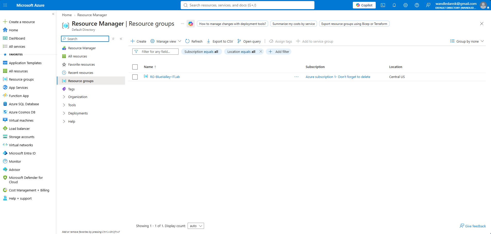
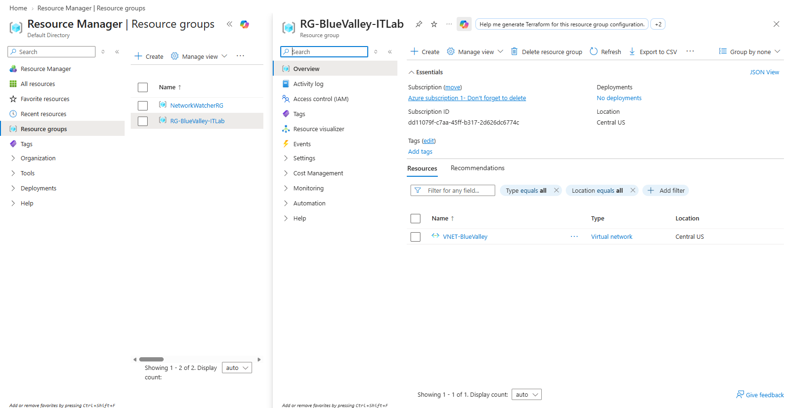
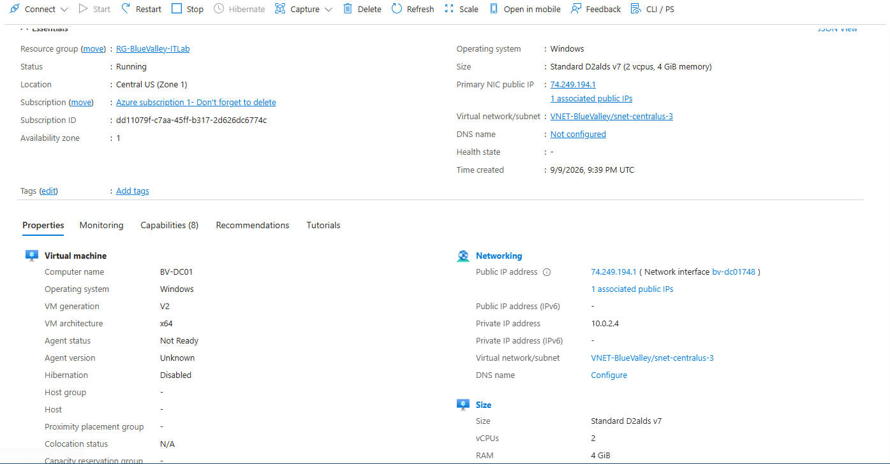
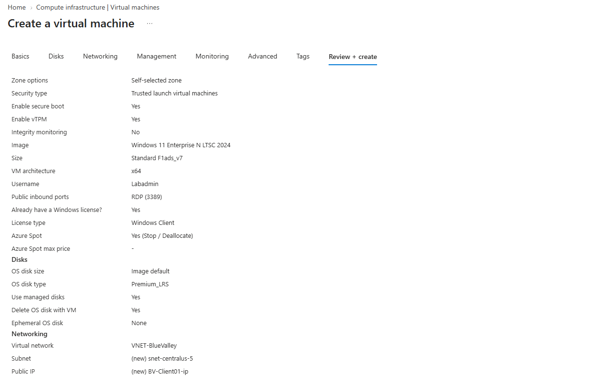

[← Back to Main Project](../README.md)

# Blue Valley Active Directory Infrastructure

## Overview

This section documents the creation and configuration of the Active Directory infrastructure used for the **Blue Valley IT Help Desk Lab**.

The goal was to build a simulated Windows business environment where domain users could be centrally managed and authenticated. This environment would later provide the foundation for realistic Help Desk scenarios involving account management, permissions, security groups, and employee onboarding.

The lab was hosted in **Microsoft Azure** and consisted of two primary virtual machines:

- **BV-DC01** - Windows Server domain controller running Active Directory Domain Services (AD DS) and DNS.
- **BV-Client01** - Windows 11 client workstation joined to the Blue Valley domain.

The basic infrastructure followed this design:

**Microsoft Azure → Virtual Network → BV-DC01 (Domain Controller/DNS) → BV-Client01 (Domain Client)**

---

## 1. Azure Lab Environment

Before configuring Active Directory, I created the Azure infrastructure required to host the Windows domain environment.

### Resource Group

I used an Azure Resource Group to keep the resources associated with the Blue Valley lab organized together.

**Why this was important:**  
A Resource Group provides a logical container for related Azure resources. Keeping the virtual machines, networking components, and other lab resources organized together makes the environment easier to manage.

### Virtual Network

I configured an Azure Virtual Network (VNet) so the domain controller and client workstation could communicate with each other over a private network.

**Why this was important:**  
Active Directory relies on network communication between domain clients and the domain controller. Placing both virtual machines on the same virtual network allows BV-Client01 to communicate with BV-DC01 for DNS resolution, authentication, and other domain services.

---

## 2. Creating the Virtual Machines

Two Azure virtual machines were used to simulate the Blue Valley business environment.

### BV-DC01 - Domain Controller

BV-DC01 was created as the Windows Server virtual machine that would become the domain controller for the Blue Valley domain.

BV-DC01 was used to provide:

- Active Directory Domain Services
- DNS
- Domain authentication
- User and group management
- Group Policy
- Centralized administration of the Blue Valley domain

### BV-Client01 - Domain Workstation

BV-Client01 was created as a Windows 11 workstation to simulate an employee computer within the organization.

This workstation would later be joined to the Blue Valley domain and used to test:

- Domain user authentication
- Active Directory account changes
- Group memberships
- Resource permissions
- Remote access
- Help Desk troubleshooting scenarios

**Why two virtual machines were used:**  
Separating the domain controller and client workstation created a more realistic client-server environment. Instead of performing all tasks on a single computer, the client depended on the domain controller for centralized authentication and domain services.
