[← Back to Main Project](../README.md)

# Blue Valley Help Desk Ticketing Lab

## Overview

This section documents the Help Desk portion of the **Blue Valley IT Help Desk Lab**.

After building the Active Directory domain environment, I used **osTicket** to simulate a ticket-based IT support workflow. I created and resolved realistic support requests involving Windows domain accounts, Active Directory, security groups, shared-folder permissions, and employee onboarding.

The purpose of these scenarios was to practice both the technical and procedural sides of IT support. Each ticket required investigating the user's issue, identifying the root cause, implementing an appropriate solution, verifying the result, documenting the work performed, and closing the ticket.

The Help Desk environment used the Active Directory infrastructure created during the first part of this project:

- **BV-DC01** - Windows Server domain controller providing Active Directory and DNS services.
- **BV-Client01** - Windows 11 domain-joined workstation used to reproduce and verify user issues.
- **osTicket** - Ticketing system used to document, track, and resolve support requests.

[View the Active Directory Infrastructure Walkthrough](../active-directory/README.md)

---

## Help Desk Troubleshooting Workflow

Throughout the project, I followed a structured troubleshooting process:

1. **Receive and review the ticket**
2. **Reproduce or verify the reported issue**
3. **Gather information and investigate the cause**
4. **Identify the root cause**
5. **Implement an appropriate resolution**
6. **Verify that the solution worked**
7. **Document the troubleshooting process and resolution**
8. **Close the ticket**

This process helped ensure that issues were not considered resolved simply because a configuration change was made. The final result was tested from the user's perspective before the ticket was closed.

---

## Ticket Scenarios

Three Help Desk scenarios were completed using the Blue Valley lab environment.

### Ticket #1 - Sarah Johnson: Account Lockout

**Department:** Accounting  
**Ticket Type:** Incident  
**Issue:** Unable to sign into the Windows domain account after multiple unsuccessful login attempts.

This scenario demonstrates Active Directory account troubleshooting, account lockout policy, Group Policy, account recovery, and verification of domain authentication.

### Ticket #2 - Mike Davis: Accounting Shared Folder Access

**Department:** Accounting  
**Ticket Type:** Incident  
**Issue:** Able to sign into the domain but receives an access denied message when attempting to access the Accounting shared folder.

This scenario demonstrates Active Directory security groups, authorization, Windows share and NTFS permissions, security token refresh, and permission troubleshooting.

### Ticket #3 - Emily Carter: New Employee Onboarding

**Department:** Accounting  
**Ticket Type:** Service Request  
**Request:** Create and configure a new domain account for an Accounting employee.

This scenario demonstrates Active Directory user provisioning, Organizational Unit placement, password configuration, security group assignment, domain authentication, and verification of resource access.
---

# Ticket #1 - Sarah Johnson: Account Lockout

## Ticket Summary

**User:** Sarah Johnson  
**Department:** Accounting  
**Ticket Type:** Incident  
**Reported Issue:** Unable to sign into the Windows domain account after multiple unsuccessful login attempts.

The objective of this ticket was to investigate Sarah's login failure, determine the root cause, restore access to her account, verify successful authentication, and document the resolution in osTicket.

---

## 1. Reviewing the Account Lockout Policy

Before reproducing the issue, I reviewed the existing domain account lockout policy.

Using the `net accounts` command, I found that the domain was originally configured with the following setting:

**Lockout threshold: Never**

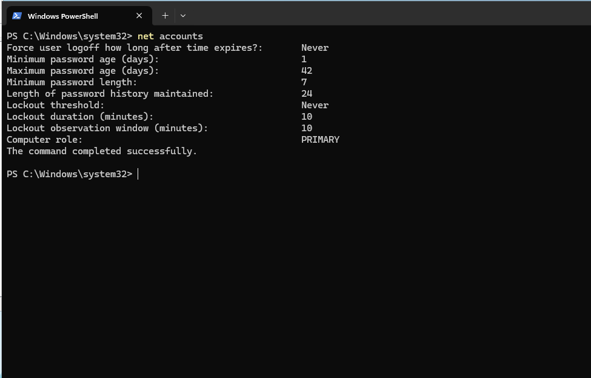

This meant that repeated incorrect password attempts would not automatically lock a user's domain account.

**Why this was important:**  
Because this was a lab environment, I needed to configure a realistic account lockout policy before I could reproduce and troubleshoot an account lockout scenario.

---

## 2. Configuring the Account Lockout Policy

Using Group Policy, I configured the domain account lockout policy so that an account would lock after **5 invalid login attempts**.

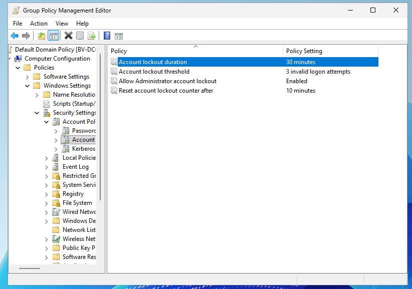

After changing the policy, I refreshed Group Policy using:

`gpupdate /force`

This ensured that the updated policy settings were applied.

**Why this was important:**  
Account lockout policies help protect user accounts against repeated unauthorized password attempts. In a Help Desk environment, these policies can also result in support tickets when legitimate users repeatedly enter an incorrect password.

---

## 3. Reviewing the Help Desk Ticket

A Help Desk ticket was created in osTicket for Sarah Johnson after she reported that she was unable to sign into her domain account.

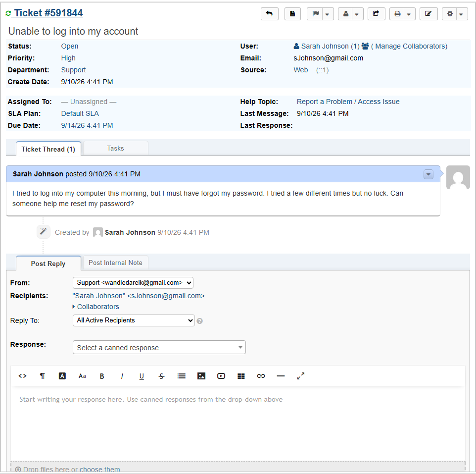

Rather than immediately changing Sarah's password or account settings, I first attempted to reproduce and verify the reported problem.

**Troubleshooting approach:**  
The reported symptom was treated as the starting point of the investigation rather than assuming the cause of the problem.

---

## 4. Reproducing the Login Failure

I attempted to sign into the domain-joined BV-Client01 workstation using Sarah's domain account.

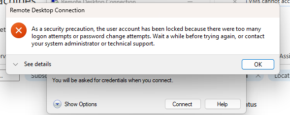

The login attempt failed, confirming that the issue described in the ticket could be reproduced.

At this point, I knew that Sarah was experiencing an authentication problem, but additional investigation was required to determine why the authentication attempt was failing.

---

## 5. Identifying the Root Cause

I checked Sarah's account in **Active Directory Users and Computers (ADUC)** and confirmed that the account had been locked.

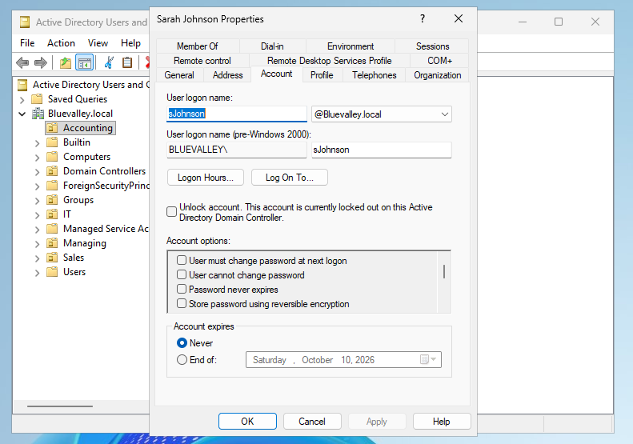

The investigation identified the root cause:

> **Root Cause:** Sarah's domain account was locked after the number of unsuccessful login attempts exceeded the configured domain account lockout threshold.

This explained why Sarah could no longer authenticate even when attempting to use the correct credentials.

---

## 6. Resolving the Issue

Because Sarah's existing password was still valid, I unlocked the account in Active Directory rather than performing an unnecessary password reset.

This was the least disruptive solution because the problem was the account's locked status rather than an unknown or expired password.

After unlocking the account, I returned to BV-Client01 and tested Sarah's account again.

The login was successful, and I verified that the authenticated account was:

`bluevalley\sjohnson`

**Resolution:**  
Sarah's Active Directory account was unlocked and access was restored without changing her existing password.

---

## 7. Verification and Ticket Closure

After confirming that Sarah could successfully authenticate to the Blue Valley domain, I documented the troubleshooting process and resolution in osTicket and closed the ticket.

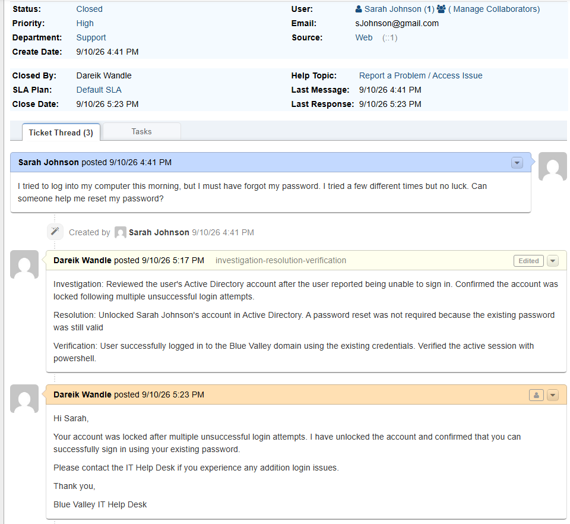

The ticket was only considered resolved after successful login was verified from the user's workstation.

### Final Resolution

- Confirmed the account was locked in Active Directory.
- Unlocked Sarah's domain account.
- Kept the existing password because a reset was not required.
- Successfully authenticated from BV-Client01.
- Verified the domain identity as `bluevalley\sjohnson`.
- Documented the resolution in osTicket.
- Closed the ticket after successful verification.

---

## Ticket #1 - Skills Demonstrated

This ticket demonstrated hands-on experience with:

- Active Directory user account administration
- Account lockout troubleshooting
- Domain account lockout policies
- Group Policy
- `net accounts`
- `gpupdate /force`
- Active Directory Users and Computers
- Windows domain authentication
- Root cause analysis
- Least-disruptive remediation
- Post-resolution verification
- Help Desk ticket documentation
- Incident resolution

### Key Takeaway

This scenario reinforced the importance of diagnosing the actual cause of a user's problem before making changes.

Although a password reset might initially appear to be an appropriate response to a login problem, the investigation showed that Sarah's password was not the root cause. The account itself was locked.

By identifying the root cause first, I was able to restore access with the least disruptive solution and verify that the issue was resolved before closing the ticket.
---

# Ticket #2 - Mike Davis: Accounting Shared Folder Access

## Ticket Summary

**User:** Mike Davis  
**Department:** Accounting  
**Ticket Type:** Incident  
**Reported Issue:** Unable to access the Accounting department shared folder.

Mike was able to authenticate to the Blue Valley domain, but received an access denied message when attempting to access the Accounting shared folder.

The objective of this ticket was to determine why Mike could successfully sign into the domain but could not access a departmental resource that he needed for his job.

---

## 1. Creating the Accounting Security Group

To manage access to Accounting resources, I created an Active Directory security group named:

`GG-Accounting-Share`

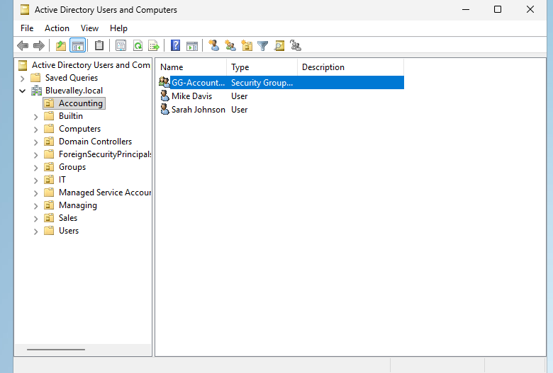

Instead of assigning folder permissions individually to every Accounting employee, permissions could be assigned to the security group. Users who required access could then be added to the group.

**Why this was important:**  
Group-based access control makes permissions easier to administer. When employees join, leave, or change roles, access can be managed through group membership rather than repeatedly modifying the permissions on the resource itself.

---

## 2. Configuring Share Permissions

The Accounting shared folder was created on BV-DC01 and made available over the network using the following UNC path:

`\\BV-DC01\Accounting`

I configured the share permissions so that members of `GG-Accounting-Share` could access the resource.

The security group was granted the appropriate **Change** and **Read** permissions rather than unnecessary Full Control.

**Why this was important:**  
Share permissions control access to a folder when it is accessed across the network. Assigning permissions to a security group allows access to be managed centrally through Active Directory membership.

---

## 3. Configuring NTFS Permissions

I also configured the NTFS permissions on the Accounting folder.

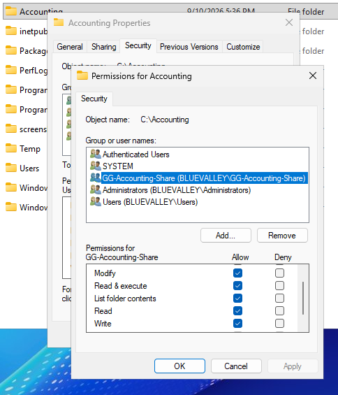

Members of `GG-Accounting-Share` were granted the permissions required to work with the departmental files, including Modify, Read, and Write capabilities.

**Why this was important:**  
When a Windows shared folder is accessed across the network, both the share permissions and NTFS permissions affect access.

Configuring both layers correctly ensured that authorized Accounting employees could use the resource without granting unnecessary permissions.

---

## 4. Establishing a Known-Good User

Before troubleshooting Mike's account, I verified that Sarah Johnson was a member of the Accounting security group.

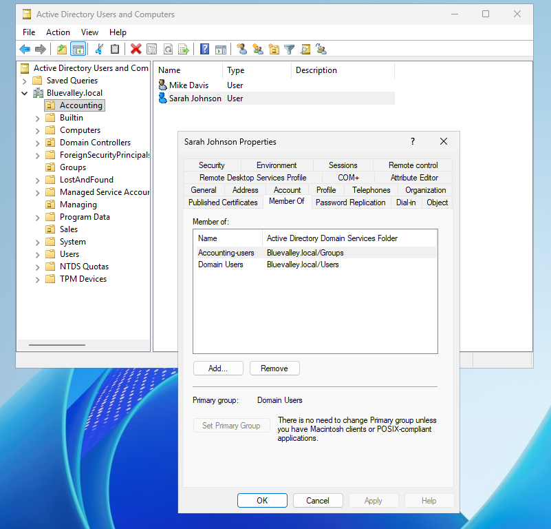

Sarah served as a known-good comparison because she had the expected Accounting access.

I then compared Sarah's membership with Mike's account.

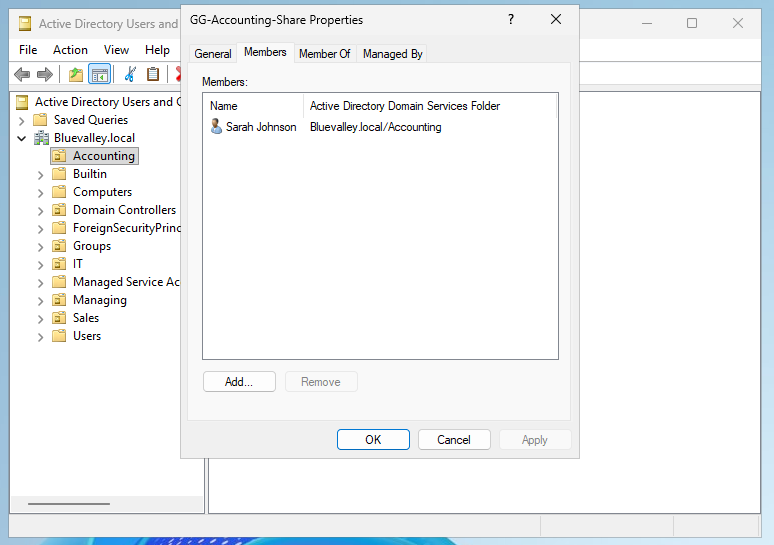

The comparison showed that Sarah was a member of `GG-Accounting-Share`, while Mike was not.

This provided an important clue that the problem was related to Mike's authorization rather than a failure of the shared folder itself.

---

## 5. Preparing Mike's Test Session

To reproduce the issue from Mike's account, I needed to sign into BV-Client01 using his domain credentials.

Mike initially did not have permission to use Remote Desktop on the workstation, so I added his domain account to the local **Remote Desktop Users** group on BV-Client01.

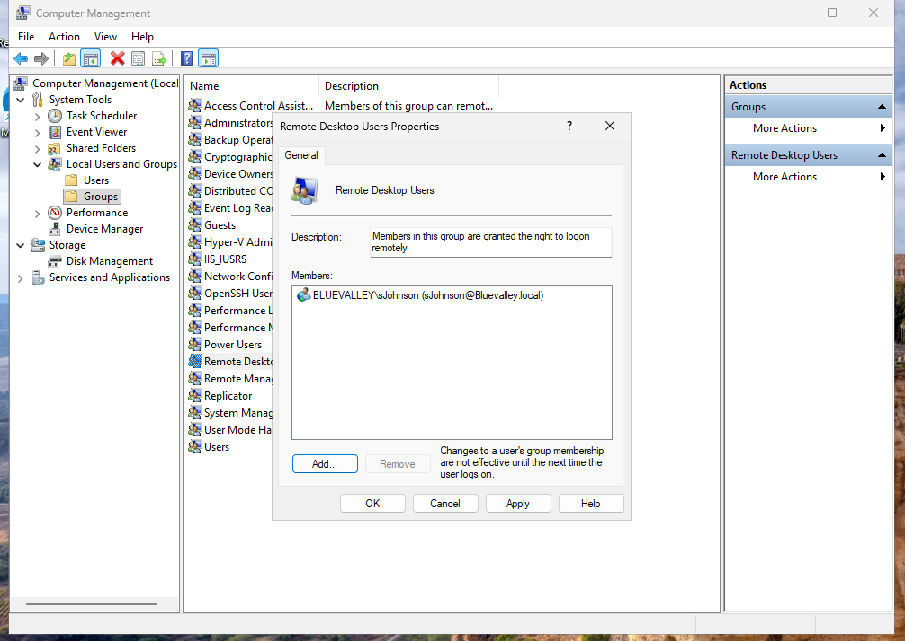

This change was made to support testing within the Azure lab environment.

**Important distinction:**  
Remote Desktop access was not the root cause of Mike's Accounting folder problem. It was a separate lab requirement that allowed me to establish a session as Mike and reproduce the reported issue from his perspective.

---

## 6. Reviewing the Help Desk Ticket

The incident was documented in osTicket as an Accounting shared-folder access problem.

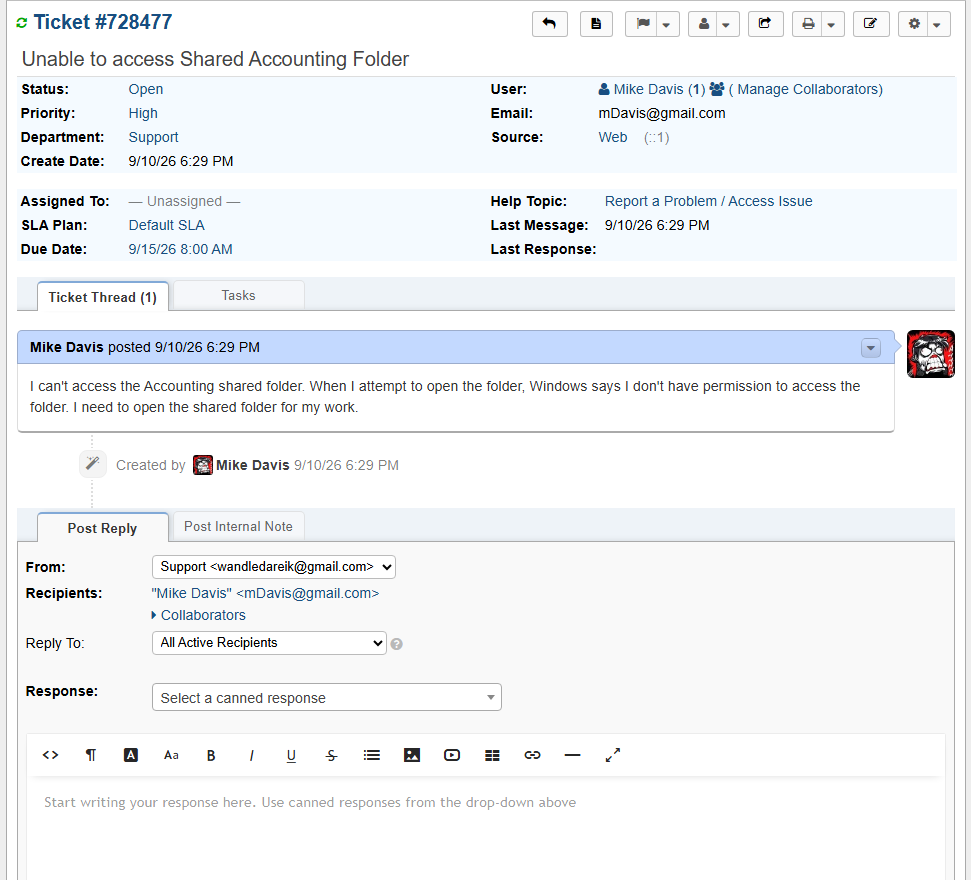

At this point, the reported symptom was clear:

Mike could authenticate to the domain, but could not access the Accounting resource.

---

## 7. Reproducing the Access Denied Error

While signed into BV-Client01 as Mike, I attempted to access:

`\\BV-DC01\Accounting`

The attempt resulted in an access denied error.

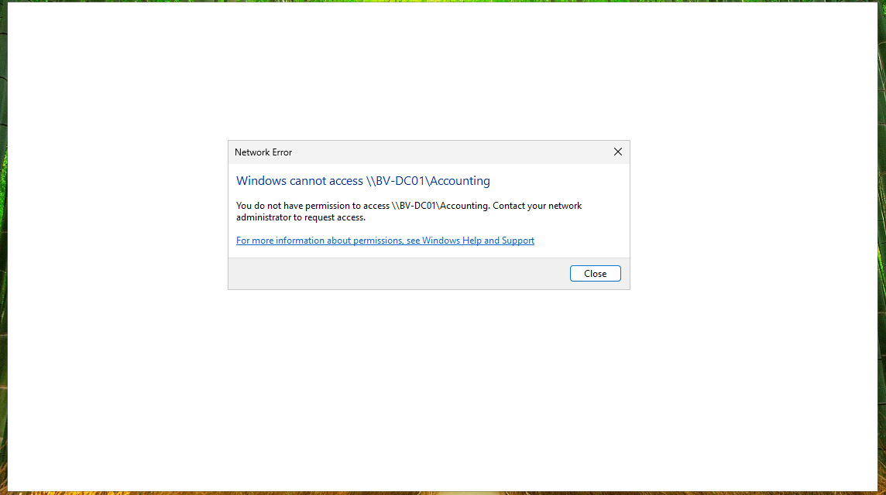

This confirmed that the issue reported in the ticket could be reproduced.

Because Mike was already successfully signed into the Blue Valley domain, his identity had been authenticated. The investigation therefore shifted toward determining whether his account was authorized to access the Accounting resource.

---

## 8. Investigating Mike's Security Groups

I used the following command while signed in as Mike:

`whoami /groups`

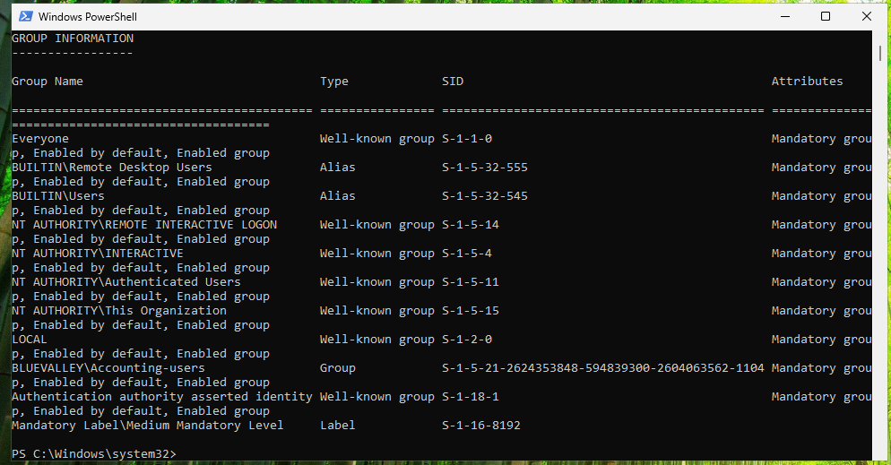

The command displayed the security groups contained in Mike's current Windows logon token.

`GG-Accounting-Share` was not present.

Combined with the earlier Active Directory membership comparison, this confirmed that Mike did not have the group membership required for access to the Accounting resource.

### Root Cause

> **Mike's domain account was not a member of the `GG-Accounting-Share` security group used to authorize access to the Accounting shared folder.**

This was an **authorization issue**, not an authentication issue.

Mike's successful domain login demonstrated that Active Directory could authenticate his identity. The missing security group membership prevented that authenticated identity from being authorized to access the Accounting resource.

---

## 9. Adding Mike to the Accounting Security Group

To resolve the issue, I added Mike's Active Directory account to `GG-Accounting-Share`.

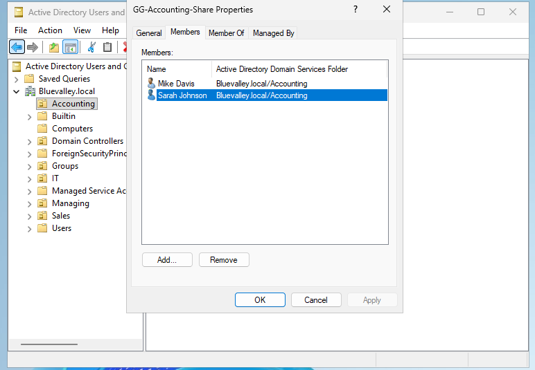

This provided Mike with the same role-based access assigned to other authorized Accounting employees.

Rather than assigning permissions directly to Mike's individual account, access continued to be controlled through the security group.

**Why this was important:**  
Using group-based permissions keeps access management scalable and consistent. The folder permissions did not need to be modified because they were already correctly assigned to `GG-Accounting-Share`.

The problem was Mike's missing group membership.

---

## 10. Refreshing Mike's Security Token

After adding Mike to the group, the change did not need to be treated as complete until it was reflected in his Windows logon session.

I signed Mike out of Windows and signed back in so that a new security token would be created with the updated group membership.

I then ran:

`whoami /groups`

again.

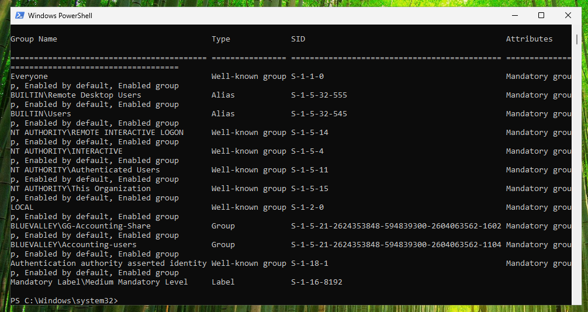

The updated results showed the new Accounting security group membership.

**Why signing out and back in mattered:**  
Windows builds a user's security token when the user signs in. Adding a user to an Active Directory security group does not necessarily update an already-existing logon token.

Signing out and back in caused Windows to create a new token containing Mike's updated group memberships.

---

## 11. Verifying Access

After refreshing Mike's logon session, I attempted to access the Accounting shared folder again.

Mike could now successfully open the Accounting folder and access the test document.

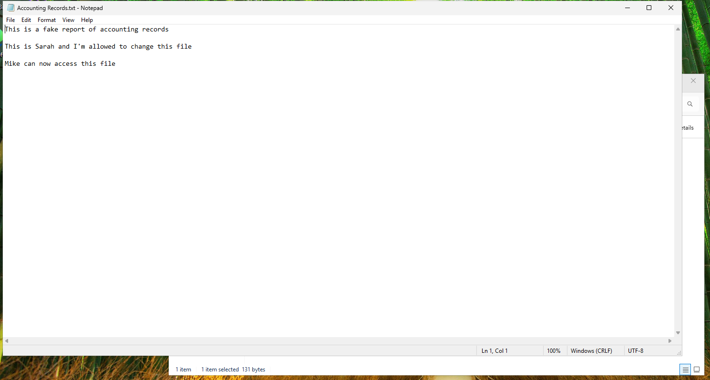

This confirmed that the security group change resolved the original problem.

The ticket was not considered resolved until access was successfully tested from Mike's account.

---

## 12. Documenting the Resolution

I documented the investigation, root cause, corrective action, and verification in the ticket's internal notes.

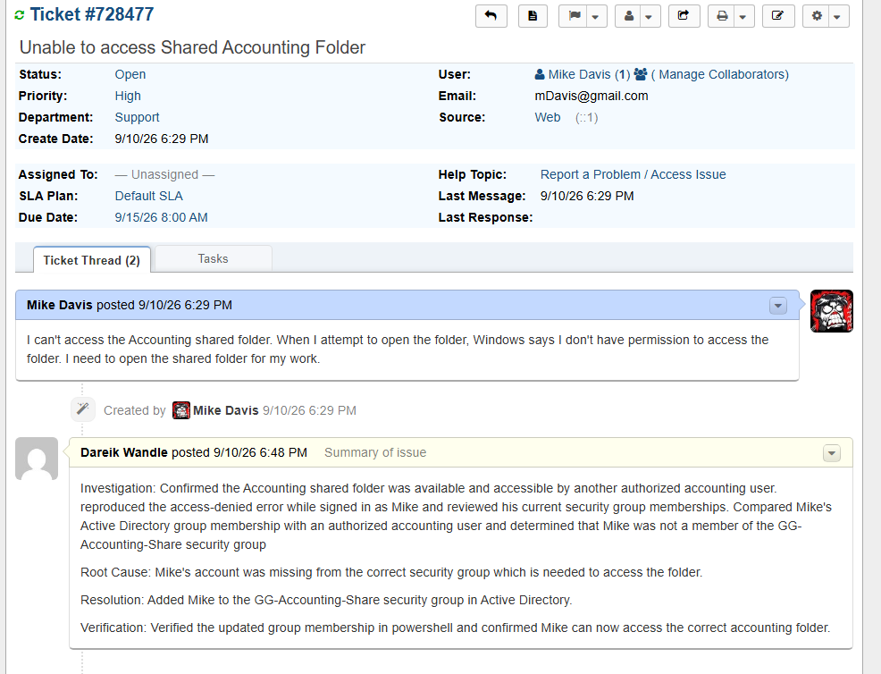

The documentation provided a record of:

- The reported access problem
- Successful domain authentication
- Reproduction of the access denied error
- Security group investigation
- Missing `GG-Accounting-Share` membership
- Addition of Mike to the appropriate security group
- Security token refresh
- Successful access verification

---

## 13. Closing the Ticket

After confirming that Mike could successfully access the Accounting resource, I provided the resolution and closed the ticket.

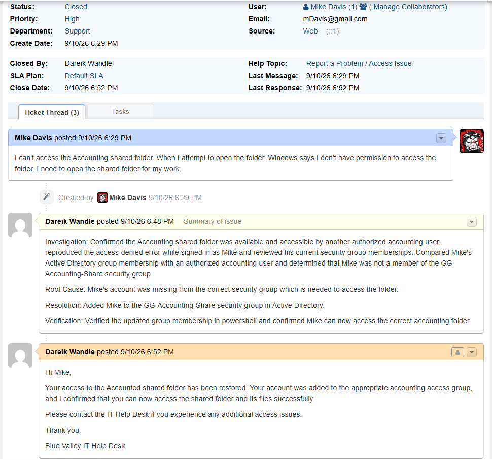

### Final Resolution

- Confirmed Mike could authenticate to the Blue Valley domain.
- Reproduced the Accounting folder access denied error.
- Compared Mike's permissions with a known-good Accounting user.
- Identified missing `GG-Accounting-Share` membership.
- Added Mike to the appropriate Active Directory security group.
- Signed out and back in to refresh his Windows security token.
- Verified the updated group membership using `whoami /groups`.
- Successfully accessed `\\BV-DC01\Accounting`.
- Documented the troubleshooting process in osTicket.
- Closed the ticket after successful verification.

---

## Ticket #2 - Skills Demonstrated

This ticket demonstrated hands-on experience with:

- Active Directory security groups
- Group-based access control
- Authentication vs. authorization
- Windows file sharing
- Share permissions
- NTFS permissions
- UNC paths
- Active Directory group membership troubleshooting
- `whoami /groups`
- Windows security tokens
- Remote Desktop access
- Root cause analysis
- Post-resolution verification
- Help Desk ticket documentation
- Incident resolution

### Key Takeaway

This scenario demonstrated the difference between **authentication** and **authorization**.

Mike could successfully sign into the Blue Valley domain, meaning his identity was authenticated. However, authentication alone did not give him permission to access every network resource.

Access to the Accounting folder was controlled through the `GG-Accounting-Share` security group. Because Mike was not originally a member of that group, he was not authorized to access the resource.

The issue was resolved by correcting the group membership rather than changing the folder permissions or Mike's password.
---

# Ticket #3 - Emily Carter: New Employee Onboarding

## Ticket Summary

**User:** Emily Carter  
**Department:** Accounting  
**Ticket Type:** Service Request  
**Request:** Create and configure a new domain account for a new Accounting employee.

Unlike the previous two tickets, this request was not submitted because an existing service had failed. The objective was to provision a new employee account with the appropriate settings and access required for Emily's role in the Accounting department.

---

## 1. Reviewing the Service Request

A new employee onboarding request was created in osTicket for Emily Carter.

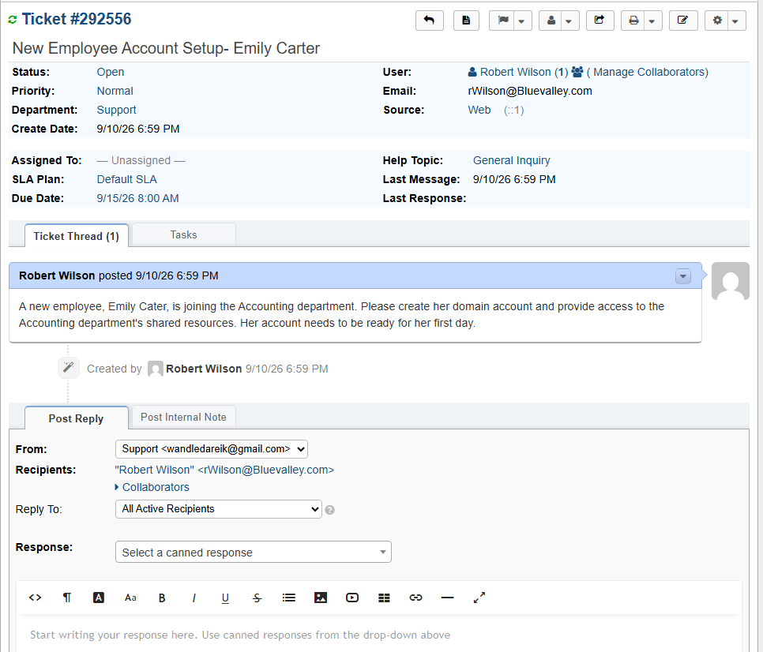

The request required the creation of a Blue Valley domain account and access to the resources required by an Accounting employee.

Before creating the account, I identified the access Emily would need based on her department and role.

**Why this was important:**  
New employee onboarding should provide the access required for the employee to perform their job while avoiding unnecessary permissions.

---

## 2. Creating Emily's Active Directory Account

Using Active Directory Users and Computers, I created a new domain user account for Emily Carter.

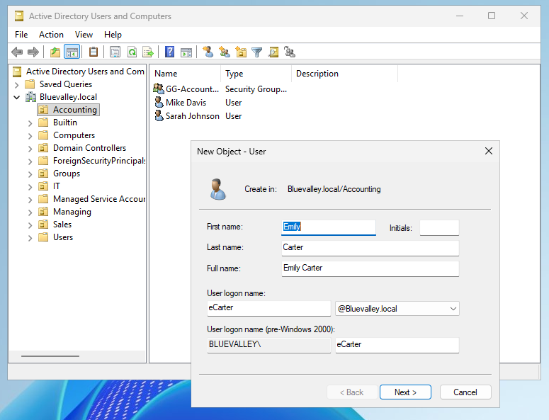

The account was created with the username:

`ecarter`

Emily's account was placed in the appropriate Organizational Unit for the Blue Valley environment.

An initial temporary password was configured, and the account was set to require a password change at first logon.

> **Security Note:** Passwords and other authentication secrets are intentionally not documented in this repository.

**Why this was important:**  
Creating the account within Active Directory allows Emily to use a centralized domain identity rather than a separate local account on an individual workstation.

Requiring a password change at first logon also allows the employee to establish a password that is not known by the administrator after the initial account setup.

---

## 3. Assigning Accounting Access

Because Emily was joining the Accounting department, I added her domain account to the appropriate Accounting security group.

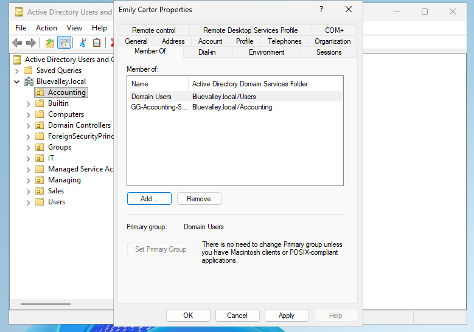

Emily was added to:

`GG-Accounting-Share`

The Accounting shared-folder permissions were already assigned to this security group. Therefore, I did not need to modify the folder permissions specifically for Emily.

**Why this was important:**  
Access was assigned based on the employee's role through group membership rather than directly assigning permissions to an individual user.

This provides a more manageable approach because the resource permissions remain attached to the security group while employee access can be controlled through group membership.

---

## 4. Verifying Domain Authentication

After creating and configuring Emily's account, I tested the account from the domain-joined BV-Client01 workstation.

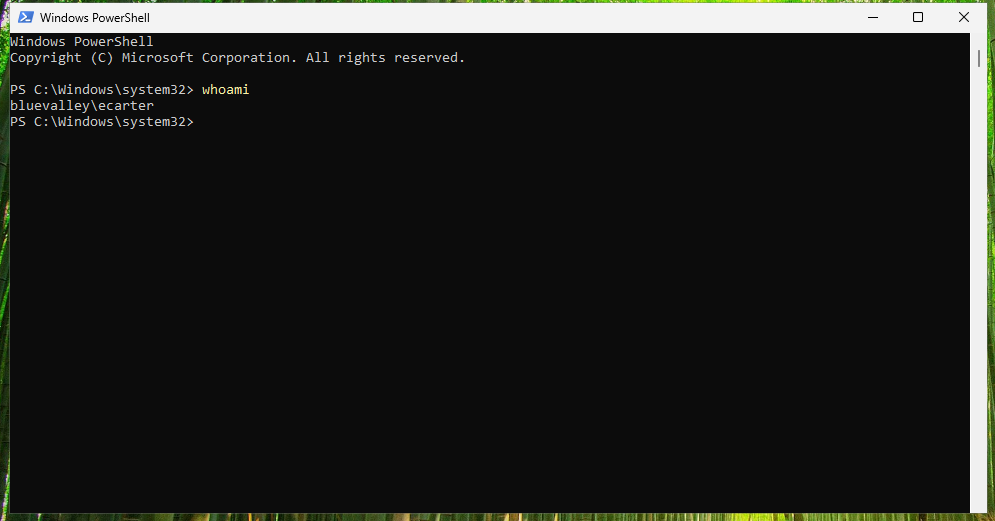

During the initial sign-in process, the temporary password configuration required the password to be changed.

After completing the first-login process, I verified that Emily could successfully authenticate to the Blue Valley domain.

The authenticated domain account was:

`bluevalley\ecarter`

**Why verification was important:**  
Creating an account in Active Directory does not by itself prove that the employee can successfully use it.

Testing the account from a domain-joined workstation confirmed that Emily could authenticate using her new Blue Valley identity.

---

## 5. Verifying Accounting Resource Access

After confirming successful domain authentication, I tested Emily's access to the Accounting shared folder:

`\\BV-DC01\Accounting`

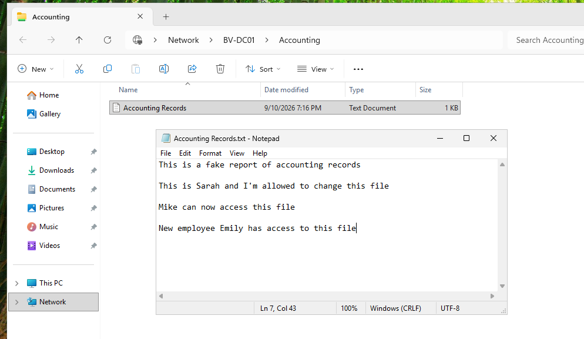

Emily was able to access the Accounting folder and the test document successfully.

This verified that her membership in `GG-Accounting-Share` provided the expected departmental access.

At this point, both major onboarding requirements had been verified:

- **Authentication** - Emily could successfully sign into the Blue Valley domain.
- **Authorization** - Emily could successfully access the Accounting resource required for her role.

---

## 6. Documenting the Onboarding Work

After verifying the new account and departmental access, I documented the completed work in the osTicket service request.

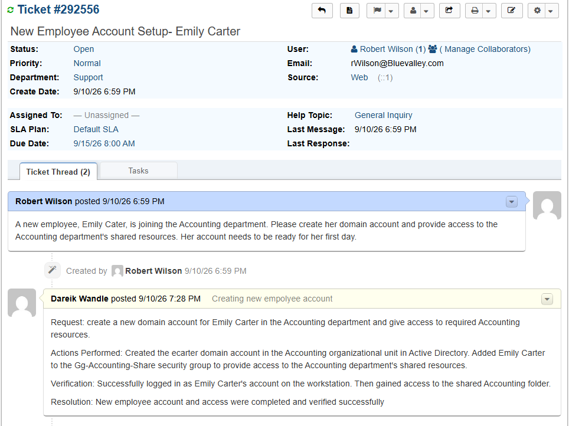

The internal documentation included:

- Creation of Emily's Active Directory account
- Appropriate Organizational Unit placement
- Initial password configuration
- Required password change at first logon
- Accounting security group assignment
- Successful domain authentication
- Successful Accounting resource access

Documenting these actions provides a record of what was provisioned and how the request was verified.

---

## 7. Closing the Service Request

After confirming that Emily's account was functioning correctly and that she had access to the required Accounting resource, I completed and closed the service request.

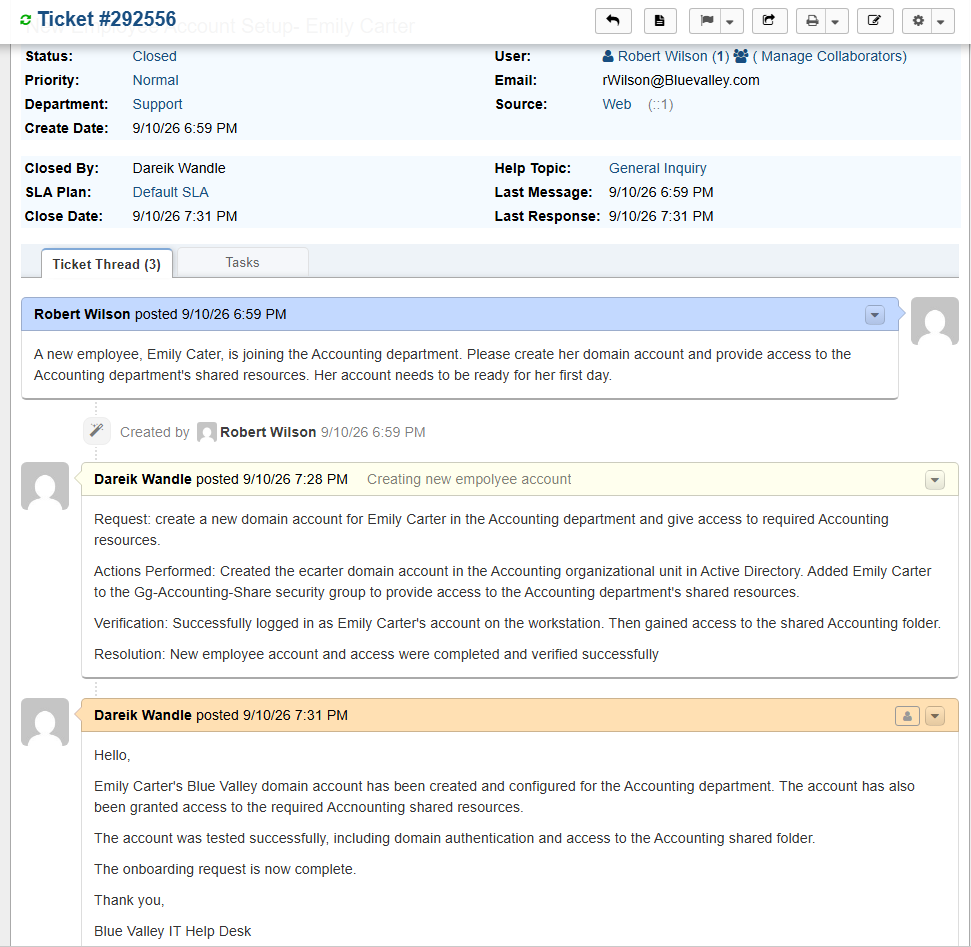

### Final Resolution

- Created the `ecarter` Active Directory domain account.
- Placed the account in the appropriate Organizational Unit.
- Configured an initial temporary password.
- Required a password change at first logon.
- Added Emily to `GG-Accounting-Share`.
- Verified successful authentication from BV-Client01.
- Verified access to `\\BV-DC01\Accounting`.
- Documented the completed onboarding work in osTicket.
- Closed the service request after successful verification.

---

## Ticket #3 - Skills Demonstrated

This service request demonstrated hands-on experience with:

- Active Directory user provisioning
- Active Directory Users and Computers
- Organizational Units
- User account configuration
- Password management
- Active Directory security groups
- Role-based access
- Windows domain authentication
- Shared-folder access
- Authentication vs. authorization
- New employee onboarding
- Post-configuration verification
- Help Desk documentation
- Service request fulfillment

### Key Takeaway

This scenario demonstrated that Help Desk work involves more than troubleshooting broken services.

New employee onboarding is an example of a **service request** where IT provisions the accounts and access an employee needs to perform their job.

The account was not considered fully provisioned simply because it existed in Active Directory. I verified both successful domain authentication and access to the Accounting resources required for Emily's role before completing the request.
---

# Help Desk Lab Summary

## Skills Demonstrated

Through the three Help Desk scenarios in this project, I gained hands-on experience with both technical troubleshooting and structured IT support processes.

### Active Directory Administration

- Creating and managing domain user accounts
- Unlocking user accounts
- Managing Active Directory security groups
- Managing Organizational Unit placement
- Configuring user account settings
- Provisioning new employee accounts

### Authentication and Access Management

- Troubleshooting Windows domain authentication
- Understanding authentication vs. authorization
- Managing role-based access through security groups
- Troubleshooting user group memberships
- Understanding Windows security tokens
- Verifying user access after configuration changes

### Windows File and Permission Management

- Creating Windows shared folders
- Configuring share permissions
- Configuring NTFS permissions
- Using security groups to control resource access
- Troubleshooting access denied errors
- Working with UNC paths such as `\\BV-DC01\Accounting`

### Windows and Command-Line Troubleshooting

- `whoami`
- `whoami /groups`
- `net accounts`
- `gpupdate /force`
- Remote Desktop
- Windows domain login testing
- Group Policy
- Active Directory Users and Computers (ADUC)

### Help Desk Operations

- Working with incidents and service requests
- Reviewing reported symptoms
- Reproducing user issues
- Gathering troubleshooting information
- Identifying root causes
- Implementing appropriate resolutions
- Verifying solutions from the user's perspective
- Writing internal ticket notes
- Documenting resolutions
- Closing tickets after successful verification

---

## Troubleshooting Lessons

The three scenarios demonstrated different types of Help Desk work.

### Sarah Johnson - Authentication

Sarah's account lockout demonstrated an **authentication problem**. Her account existed and had the appropriate access, but the locked account prevented her from successfully authenticating to the domain.

The issue was resolved by identifying the account lockout as the root cause, unlocking the account, and verifying successful domain authentication.

### Mike Davis - Authorization

Mike's shared-folder issue demonstrated an **authorization problem**.

Mike could successfully authenticate to the Blue Valley domain, but his account was not a member of the security group used to authorize access to the Accounting shared folder.

The issue was resolved by correcting his Active Directory security group membership, refreshing his Windows logon session, and verifying access from his account.

### Emily Carter - Provisioning

Emily's onboarding request demonstrated **user provisioning and access management**.

Rather than repairing an existing problem, the request required creating a new domain identity and assigning the access appropriate for an Accounting employee.

The request was completed only after both domain authentication and Accounting resource access were successfully verified.

---

## Project Takeaways

This lab reinforced that effective Help Desk troubleshooting involves more than making configuration changes.

A structured troubleshooting process helped me move from the user's reported symptom to the actual root cause of each issue:

**Reported Issue → Reproduce → Investigate → Identify Root Cause → Resolve → Verify → Document → Close**

One of the most important lessons from the project was the distinction between **authentication** and **authorization**.

Authentication answers:

> **Who is the user?**

Authorization answers:

> **What is the user allowed to access?**

Mike's ticket provided a practical example of this distinction. His successful domain login proved that his identity could be authenticated, while his missing Accounting security group membership prevented him from being authorized to access the departmental resource.

The project also demonstrated the value of using Active Directory security groups to manage access based on job responsibilities rather than assigning permissions directly to individual users.

Finally, each scenario reinforced the importance of verification. A ticket was not considered complete simply because a change had been made. The solution was tested from the user's perspective before the ticket was documented and closed.

---

## Technologies Used

- Microsoft Azure
- Windows Server
- Windows 11
- Active Directory Domain Services (AD DS)
- Active Directory Users and Computers (ADUC)
- DNS
- Group Policy
- PowerShell / Command Prompt
- Remote Desktop Protocol (RDP)
- Windows File Sharing
- NTFS Permissions
- Active Directory Security Groups
- osTicket
- GitHub

---

## Project Navigation

This Help Desk lab is the second part of the complete **Blue Valley IT Help Desk Lab**.

### Part 1 - Active Directory Infrastructure

[View the Active Directory Infrastructure Walkthrough](../active-directory/README.md)

Documents the creation of the Azure virtual machines, Windows domain, DNS configuration, Organizational Units, users, security groups, and domain-joined workstation used throughout the Help Desk scenarios.

### Part 2 - Help Desk Ticketing Scenarios

This README documents the three Help Desk scenarios performed using the completed Blue Valley Active Directory environment.

### Main Project

[← Return to the Blue Valley IT Help Desk Lab Overview](../README.md)

---

## Conclusion

The Blue Valley IT Help Desk Lab provided hands-on experience building a Windows domain environment and using that infrastructure to solve realistic IT support problems.

By combining Active Directory administration with Help Desk ticket management, the project demonstrates my ability to work through common entry-level IT support tasks while following a structured troubleshooting and documentation process.

The completed lab demonstrates experience with user account administration, domain authentication, access control, security groups, Windows permissions, employee onboarding, troubleshooting, verification, and ticket documentation.
